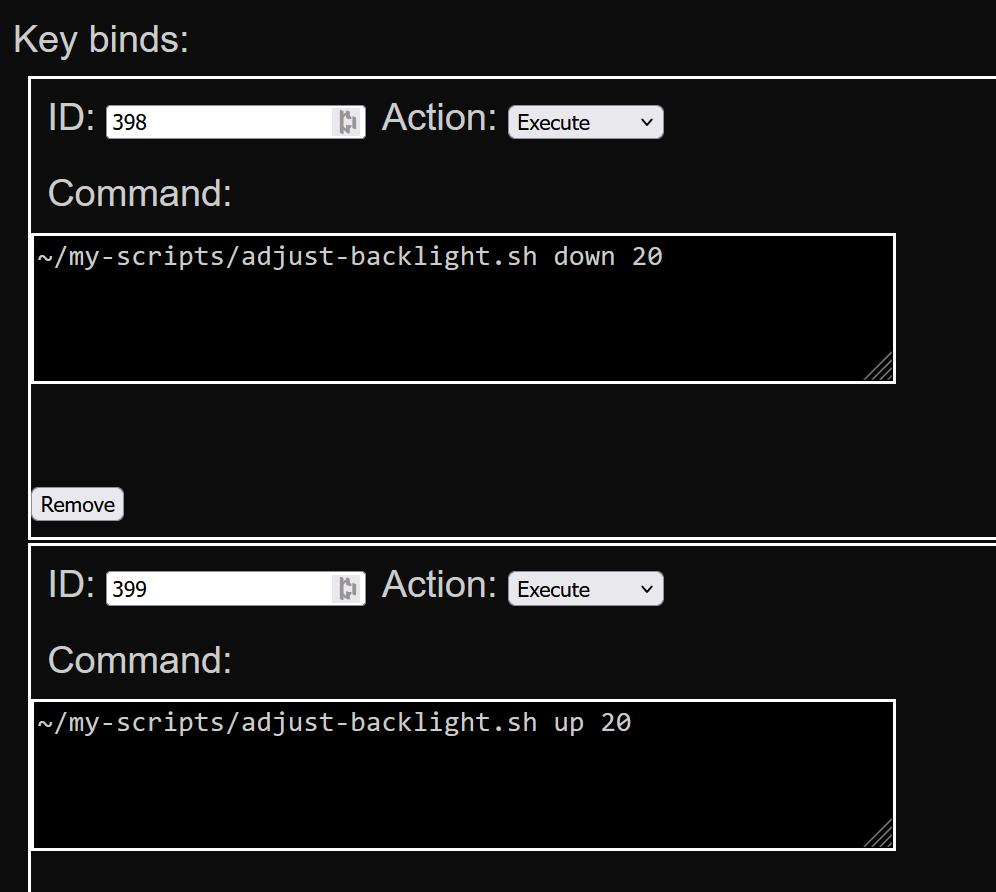

Adjust the brightness of your LG TV with a single button press instead of constantly having to navigate through TV settings.

1. Move `adjust-backlight.sh` to a directory on your TV (I used the webOS Dev Manager to make it easy)
2. Run `chmod +x ./adjust-backlight.sh` in the TV directory to make it executable.
3. Use the [LG Input Hook](https://github.com/Simon34545/lginputhook) app to map the execution of this script to a convenient button on your remote. I use the red and green buttons.

4. Enjoy!

Note: The LG Input Hook app can take around 30 seconds after TV startup before custom key binds (includinng this one) are available.